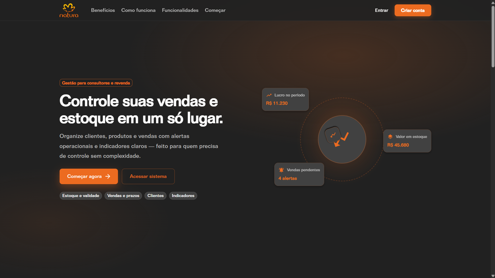
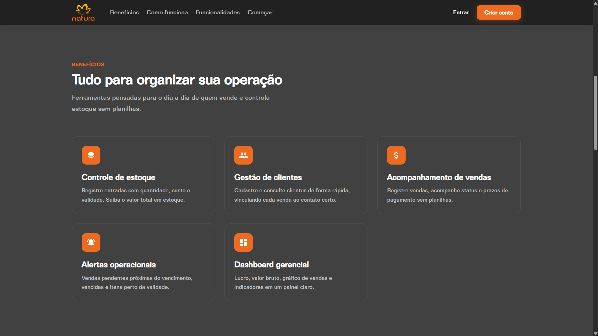
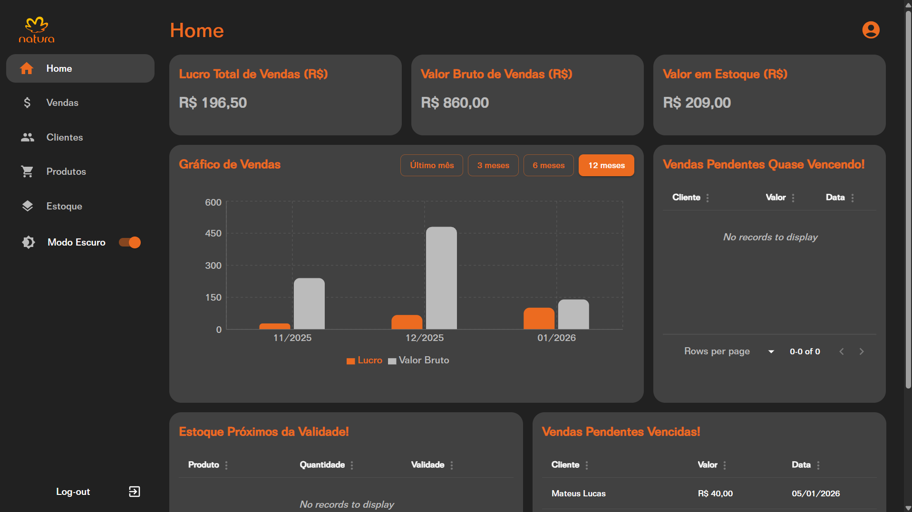
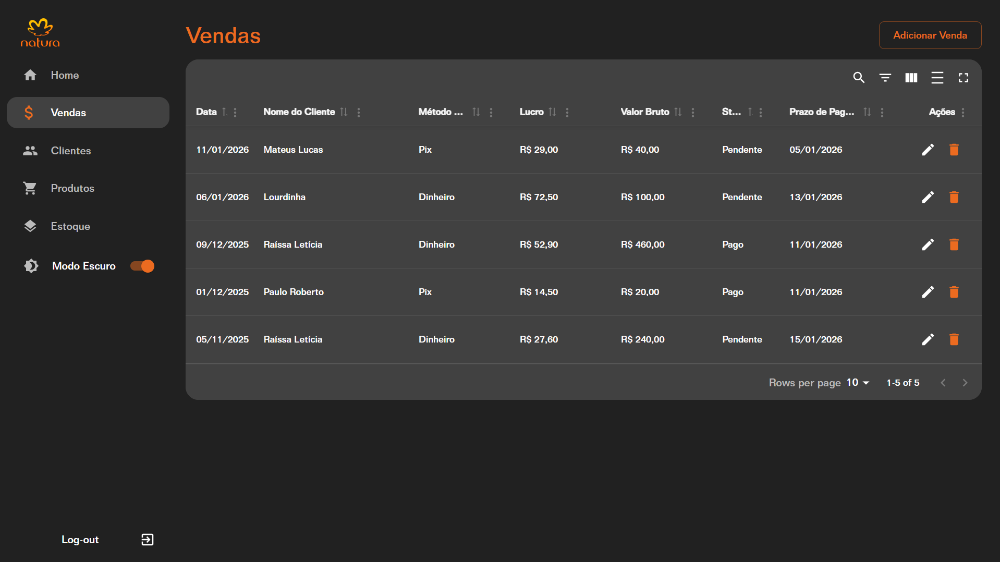

# Natura App — Controle de Estoque e Vendas

Ferramenta para **consultores e revenda** que precisam de **controle de vendas e estoque em um só lugar** — sem planilhas, com indicadores claros e alertas que ajudam a agir no dia a dia.

---

## O problema

Quem vende e repõe estoque costuma lidar com informação espalhada: clientes em um lugar, produtos em outro, vendas anotadas à parte e validade “na cabeça”. Isso gera atrito operacional:

- **Dificuldade para saber quanto lucrou** e quanto ainda está em aberto
- **Vendas pendentes** que passam do prazo sem aviso
- **Produtos perto da validade** sem priorização
- **Estoque sem visão de valor** (quanto está parado em prateleira)
- **Retrabalho** ao cadastrar a mesma informação em vários lugares

O Natura App centraliza **clientes, produtos, estoque e vendas** e coloca na frente o que importa: **números, prazos e alertas**.

---

## A solução

Um sistema web pensado para a rotina de quem vende: cadastrar rápido, consultar com clareza e acompanhar a operação por um **dashboard** com lucro, vendas, estoque e avisos operacionais.

| Você precisa de… | O sistema oferece… |
| --- | --- |
| Ver resultado do período | Lucro total, valor bruto de vendas e gráfico com filtro (1, 3, 6 ou 12 meses) |
| Saber o que está parado em estoque | Valor total em estoque e controle por entrada (quantidade, custo, validade) |
| Não perder cobrança | Alertas de vendas pendentes **quase vencendo** e **vencidas** |
| Priorizar giro | Alertas de itens **próximos da validade** |
| Organizar a base | Cadastro e gestão de **clientes** e **produtos**, com vendas vinculadas ao cliente certo |

---

## Interface

### Página inicial — proposta e benefícios

  

  

### Dashboard — indicadores e alertas

Visão gerencial com cards de **lucro**, **valor bruto**, **valor em estoque**, gráfico de vendas por período e tabelas de alertas (pendências e validade).

  

### Vendas — status, prazos e lucro

Registre vendas, acompanhe **pendente** ou **pago**, prazo de pagamento, lucro e valor bruto por transação.

  

---

## O que você consegue fazer

- **Entrar e manter sua conta** — acesso seguro à sua operação
- **Clientes** — cadastro e consulta; cada venda ligada ao contato certo
- **Produtos** — catálogo para usar nas vendas e no estoque
- **Estoque** — entradas com quantidade, custo e validade; visão do valor total
- **Vendas** — registro com método de pagamento, lucro, valor bruto, status e prazo
- **Home (dashboard)** — números do período, gráfico e alertas para agir antes do problema virar prejuízo

---

## Como funciona na prática

1. **Cadastre** clientes e produtos.
2. **Registre entradas** no estoque (com validade quando fizer sentido).
3. **Lance vendas** e defina status e prazo de pagamento.
4. **Use o dashboard** para ver lucro, vendas no período, valor em estoque e o que exige atenção hoje.

O fluxo é direto: menos tempo organizando planilha, mais tempo vendendo e decidindo com base em dados.

---

## Para quem é

- Consultores e revendedores que precisam de **controle sem complexidade**
- Quem quer **substituir planilhas** por um painel único
- Operações que dependem de **prazo de pagamento** e **validade de produto**

---

## Stack (referência)

Backend em **NestJS** (API REST, JWT, MySQL via TypeORM). Frontend em **React + Vite**, **Material UI** e **Tailwind CSS**, consumindo a API com **Axios**.
