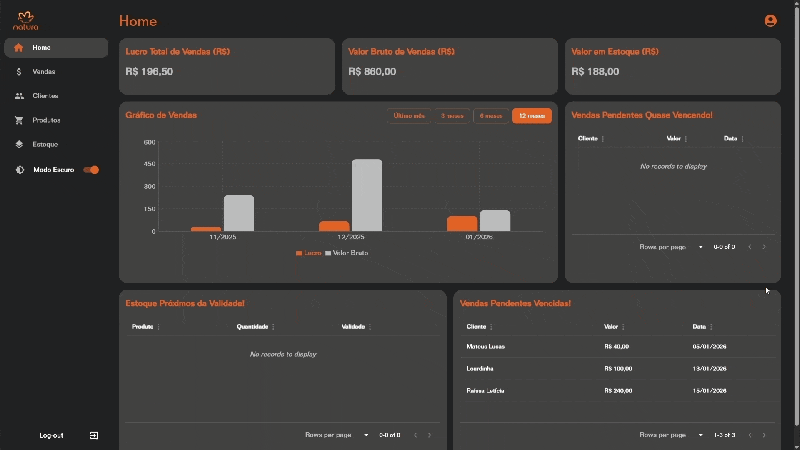

# Natura App — Controle de Estoque e Vendas

Sistema **fullstack** para **controle de estoque e vendas**, com **dashboard interativo** para acompanhamento de indicadores e alertas operacionais.

O projeto foi desenvolvido com **Backend em NestJS** (API REST, autenticação e persistência em MySQL) e **Frontend em React + Vite**, utilizando **Material UI** para uma interface consistente e orientada à produtividade.

---

## Visão geral

- **Propósito**: apoiar a operação de vendas e gestão de estoque em um único sistema
- **Proposta**: oferecer uma experiência direta para **cadastrar, consultar, acompanhar e agir** (estoque, clientes e vendas), com visão gerencial por meio de um dashboard

---

## O que o sistema entrega

- **Autenticação** (login/registro) com **JWT**
- **Cadastro e gestão de clientes**
- **Cadastro e gestão de produtos**
- **Controle de estoque por itens** (entradas com quantidade, custo e validade)
- **Vendas** com acompanhamento por status e prazos (pendências)
- **Dashboard interativo**, com:
  - **Lucro total** e **valor bruto de vendas** por período
  - **Valor total em estoque**
  - **Gráfico de vendas** com filtro de período
  - Alertas operacionais: **vendas pendentes** (próximas do vencimento e vencidas) e **itens próximos da validade**

---

## Interface

<p align="center">
  
</p>

---

## Estrutura do projeto

```txt
natura-app/
├── backend/        # API (NestJS)
├── frontend/       # Aplicação web (React + Vite)
└── README.md
```

---

## Pré-requisitos

- **Node.js** (recomendado: 20.x, conforme `backend/package.json`)
- **NPM**
- **MySQL** local (ou acessível em rede)
- **Git**

Verifique:

```bash
node -v
npm -v
git -v
```

---

## Backend (NestJS)

A partir da raiz do projeto:

```bash
cd backend
```

### Instalar dependências

```bash
npm install
```

### Variáveis de ambiente

Crie um arquivo **`.env`** em `backend/` com base no `backend/.env.example`:

```env
DB_HOST=127.0.0.1
DB_PORT=3306
DB_USER=root
DB_PASS=senha
DB_NAME=nome
JWT_SECRET=seu-token
FRONTEND_URL=http://localhost:5173
```

**Importante**

- Não versionar `.env`
- Garanta que o MySQL esteja ativo e que o schema (`DB_NAME`) exista (ou esteja configurado conforme seu ambiente)

### Rodar a API

```bash
npm run start:dev
```

A API sobe em:

```txt
http://localhost:3000
```

---

## Frontend (React + Vite)

A partir da raiz do projeto:

```bash
cd frontend
```

### Instalar dependências

```bash
npm install
```

### Variáveis de ambiente

Crie um arquivo **`.env`** em `frontend/` com base no `frontend/.env.example`:

```env
VITE_API_URL="http://localhost:3000"
```

### Rodar o frontend

```bash
npm run dev
```

A aplicação web fica disponível em:

```txt
http://localhost:5173
```

---

## Fluxo de inicialização (do zero)

```bash
# Clonar
git clone https://github.com/mateusjm/natura-app.git
cd natura-app

# Backend
cd backend
npm install
npm run start:dev

# Frontend (em outro terminal)
cd ../frontend
npm install
npm run dev
```

---

## Tecnologias

### Backend

- NestJS
- TypeORM
- MySQL
- JWT

### Frontend

- React + Vite
- TypeScript
- Material UI
- Tailwind CSS
- Axios
---

## Organização interna (visão técnica)

- **Módulos da API**: `auth`, `user`, `client`, `product`, `product-item` (estoque), `sale` e `sale-product-item`
- **Páginas**: Home (Dashboard), Vendas, Clientes, Produtos e Estoque
- **Serviços de integração**: camada `services/` no frontend consumindo a API via Axios
- **Contextos/Estado**: autenticação e filtros (ex.: período do dashboard)

---

## Observações

- Backend e frontend devem rodar **simultaneamente**
- Portas padrão: **3000** (API) e **5173** (web)
- O CORS do backend usa `FRONTEND_URL` para permitir o acesso do frontend
